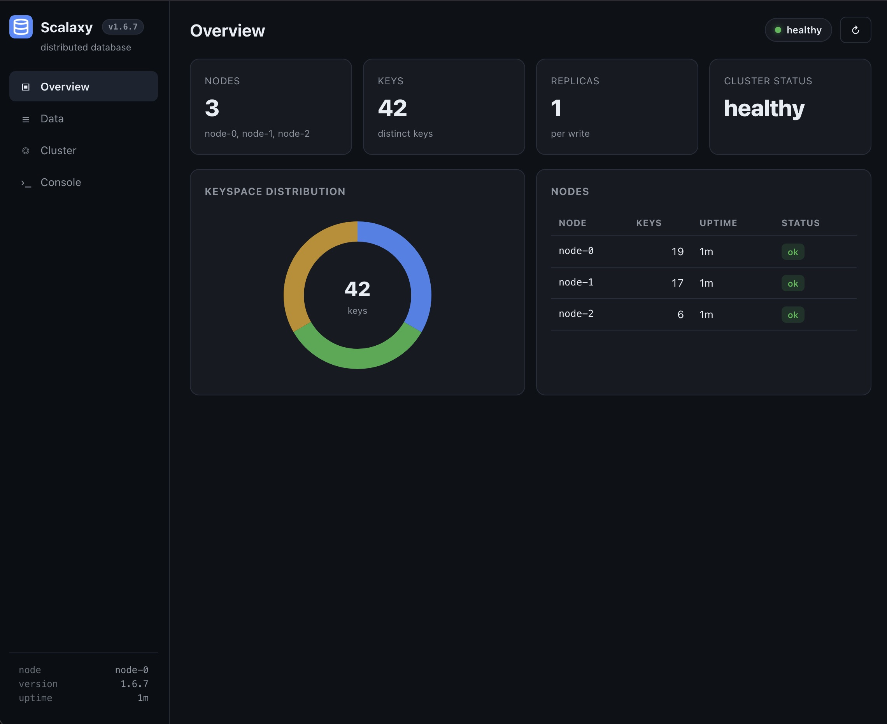
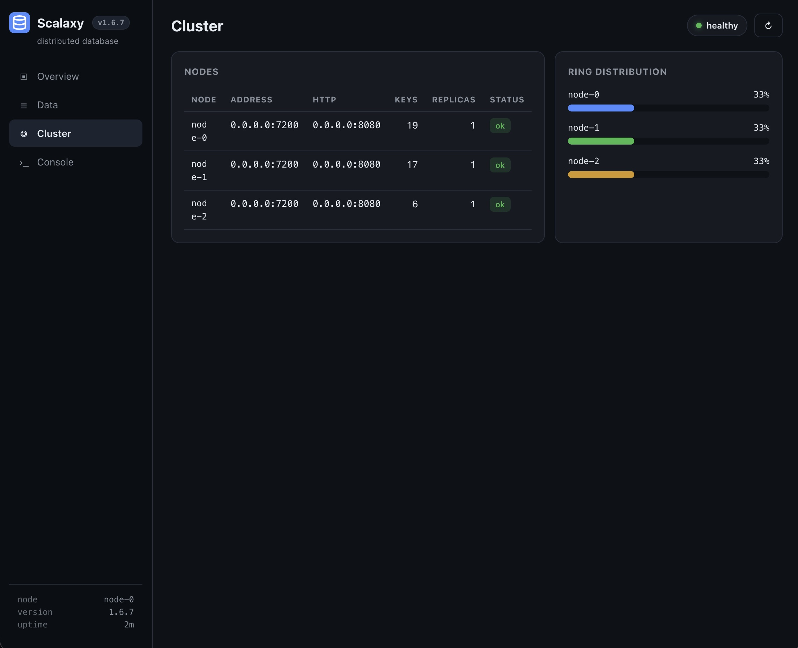

# Scalaxy

**Multi-purpose, cloud-ready distributed database.**


Scalaxy is an open-source distributed key/value database written in
[Common Lisp](https://common-lisp.net/). Keys are sharded across nodes with
consistent hashing, writes are synchronously replicated to follower nodes,
and every mutation is durably recorded in an append-only log that is replayed
on startup.

> **Independence notice.** Scalaxy is an independent open source distributed
> database project associated with scalaxy.org, a domain registered by the
> project owner in 2014. This project is **not affiliated with, sponsored by,
> endorsed by, authorized by, or operated by Scalaxy B.V. or scalaxy.com**.
> Project site: <https://scalaxy.org>

## Screenshots

The web console ships with every node. Click to enlarge.

<p align="center">
  
</p>
<p align="center"><em>Cluster overview: nodes, keys, replication, and ring distribution.</em></p>

<p align="center">
  
</p>
<p align="center"><em>Data browser: search, pagination, and key inspection.</em></p>

## Features

- **Web console** — a professional dashboard (overview, data browser,
  cluster view, command console) written in Common Lisp, served over HTTP
  with a JSON REST API and a `/healthz` endpoint for probes.
- **Consistent hashing sharding** — keys are placed on a virtual-node ring
  (FNV-1a + SplitMix64); adding or removing a node moves only ~1/N of the
  keys.
- **Synchronous leader replication** — every write is forwarded to the next
  `N` nodes in ring order and acknowledged before the client returns.
- **Read failover** — if the ring owner of a key is unreachable, reads fall
  back to the remaining members (which hold the replicas).
- **Durable append-only log** — each node persists mutations to a
  length-prefixed log (same record format as the network protocol) and
  replays it on startup, so a crash loses nothing already acknowledged.
- **Binary wire protocol** — compact length-prefixed frames over TCP.
- **Gateway routing** — with `SCALAXY_PEERS` configured, any node routes key
  operations to the ring owner and aggregates cluster status, so every node
  exposes the full cluster UI.
- **Graph database with Cypher** — a property-graph layer over the same
  replicated store, queried with the openCypher language (`MATCH`, `CREATE`,
  `MERGE`, paths, aggregation, the full core expression language), all in
  pure Common Lisp.  See [docs/cypher-reference.md](docs/cypher-reference.md)
  and the [certification report](docs/cypher-certification.md).
- **No external dependencies** — pure ANSI Common Lisp (plus the SBCL
  socket/thread facilities for the network layer).

## Architecture

```
+--------------------------------------------------------------+
|                         client (API)                          |
+--------------------------------------------------------------+
        | put/get/delete/scan over TCP (binary frames)
        v
+--------------------------------------------------------------+
|  consistent-hash ring  ->  primary node owns key             |
|  node-put: apply locally, persist to log, replicate to       |
|            next N ring nodes, await acks                     |
+--------------------------------------------------------------+
|  per-node storage: in-memory hash table + append-only log    |
+--------------------------------------------------------------+
```

Source layout:

```
scalaxy.asd            ASDF system definition
src/package.lisp       package definition
src/util.lisp          FNV-1a + SplitMix64 hashing, octet/string helpers
src/protocol.lisp      binary wire format + framing
src/storage.lisp       durable key/value store (log + replay)
src/consistent-hash.lisp  virtual-node consistent hashing ring
src/replication.lisp   leader op log
src/node.lisp          storage node + request dispatch
src/tcp.lisp           SBCL TCP server/client
src/json.lisp          dependency-free JSON encoder/decoder
src/http.lisp          minimal HTTP/1.1 server/client (SBCL)
src/web.lisp           web console: dashboard, REST API, /healthz
src/gateway.lisp       cluster gateway: ring routing + failover + status
src/cluster.lisp       in-process cluster: routing + replication
src/api.lisp           high-level client API
src/db.lisp            multi-database registry
src/graph.lisp         property-graph storage over the KV store
src/codec.lisp         binary codec for Cypher values
src/cypher/            the Cypher engine: conditions, AST, lexer, parser,
                       functions, semantics, updates, executor, wire,
                       reference oracle
src/main.lisp          standalone node entry point (CLI + env config)
web/                   console assets (HTML/CSS/JS)
tests/                 self-contained test suite (no frameworks)
scripts/               build/test launchers
deploy/                Docker / docker-compose / Kubernetes manifests
```

## Quick start

Requirements: [SBCL](https://www.sbcl.org/) 2.x (any recent version).

```sh
# run the test suite (9018 checks)
make test

# or, from the repo root:
sbcl --script scripts/run-tests.lisp
```

Start a standalone node:

```sh
bin/scalaxy --address 127.0.0.1:7200 --data-dir ./data --id node-a
```

Talk to it from a Lisp REPL:

```lisp
(require :asdf)
(asdf:load-asd "/path/to/scalaxy/scalaxy.asd")
(asdf:load-system "scalaxy")

(defvar *db* (scalaxy:connect :host "127.0.0.1" :port 7200))

(scalaxy:put *db* "greeting" "hello world")          ; => T
(scalaxy:get *db* "greeting")                        ; => #(...octets...)
(scalaxy:octets-to-string (scalaxy:get *db* "greeting"))
;; => "hello world"

(scalaxy:scan *db* "gre")                            ; => (("greeting" . #(...)))
(scalaxy:delete *db* "greeting")                     ; => T
```

Values may be strings or raw octet vectors, so any binary payload
(images, blobs, serialized documents) can be stored as-is.

## Running a cluster

The in-process cluster (`make-cluster`) is used by the test suite to exercise
routing and replication. A multi-node deployment is the same code: start one
`bin/scalaxy` process per node and point clients at any of them; the ring
routes each key to its owning node automatically.

## Testing

The suite is intentionally dependency-free (plain assertions, no test
framework) so it runs anywhere SBCL runs, including CI:

```sh
make test
```

A graph benchmark ships with the repo: the **Neo4j Movie Graph** dataset
(171 nodes, 253 relationships) and a query suite that loads and times it
against the Cypher engine:

```sh
sbcl --script scripts/run-benchmark.lisp
```

See [benchmarks/movies/README.md](benchmarks/movies/README.md) for the
dataset provenance, license, and reference timings.

A second, **large-scale** benchmark ships with the repo: the **NYC taxi
graph** (263 taxi-zone nodes and up to 2.93 million `TRIP` relationships
from real NYC TLC trip records), with two modes (zone-pair aggregated and
per-trip):

```sh
sbcl --script scripts/run-benchmark-nyc.lisp aggregated "" 20
sbcl --script scripts/run-benchmark-nyc.lisp per-trip 200000 5
sbcl --dynamic-space-size 8192 --script scripts/run-benchmark-nyc.lisp per-trip "" 1
```

See [benchmarks/nyc-taxi/README.md](benchmarks/nyc-taxi/README.md) for the
data provenance, the reproducible `prepare.py` pipeline, and scalability
notes.

## Roadmap

- [x] Consistent-hash routing with virtual nodes
- [x] Durable append-only log with replay
- [x] Synchronous leader replication
- [x] TCP server/client and client API
- [ ] Snapshot-based catch-up for lagging replicas
- [ ] Membership/join protocol for nodes to discover each other
- [ ] Multi-key transactions
- [x] Graph database with the openCypher query language (see docs/cypher-*)

## Web console

Every node serves a web console on its HTTP port (default `8080`):

- **Overview** — cluster health, key/node counts, keyspace distribution ring
- **Data** — prefix search, pagination, add/view/delete keys
- **Cluster** — per-node status table and ring share bars
- **Console** — run `put` / `get` / `delete` / `scan` commands

```
GET    /healthz                liveness probe ({"status":"ok"})
GET    /                       console
GET    /api/status             cluster + node status (aggregated)
GET    /api/keys?prefix=&limit=&offset=   key list
GET    /api/keys/<key>         key value (utf8 + hex + size)
PUT    /api/keys/<key>         write {"value":"..."}
DELETE /api/keys/<key>         delete
POST   /api/query              {"command":"scan user:"}
GET    /api/node-status        local node status (used by aggregation)
```

With `SCALAXY_PEERS` set, any node's console shows the whole cluster and
routes operations to ring owners over TCP; reads fail over to replicas when
a node is down.

## Deployment (Docker / Kubernetes)

The same image runs standalone, in docker-compose, or in Kubernetes.
Configuration is 100% environment variables:

| Variable               | Default          | Description                          |
|------------------------|------------------|--------------------------------------|
| `SCALAXY_NODE_ID`      | auto             | Ring member id                       |
| `SCALAXY_ADDRESS`      | `0.0.0.0:7200`   | Data-plane TCP listen address        |
| `SCALAXY_HTTP_ADDRESS` | `0.0.0.0:8080`   | Web console / REST / health address  |
| `SCALAXY_DATA_DIR`     | `./scalaxy-data` | Durability log directory             |
| `SCALAXY_PEERS`        | (none)           | `id=host:data-port[:http-port],...`  |
| `SCALAXY_REPLICATE_TO` | (none)           | Sync replication targets (same format) |
| `SCALAXY_WEB_DIR`      | `web/`           | Console assets location              |

```sh
# Docker
docker build -t scalaxy .
docker run -p 8080:8080 -p 7200:7200 scalaxy

# 3-node docker-compose cluster
docker compose up --build      # console at http://localhost:8080

# Kubernetes (3-replica StatefulSet, PVCs, probes, non-root)
kubectl apply -f deploy/kubernetes/scalaxy.yaml
kubectl -n scalaxy port-forward svc/scalaxy 8080:80
```

See [deploy/README.md](deploy/README.md) for details.

## Project

- **Maintained by** [Artem Andreenko](https://github.com/miolini) (`miolini`)
- [Contributing](CONTRIBUTING.md) — how to get involved
- [Code of Conduct](CODE_OF_CONDUCT.md)
- [Security policy](SECURITY.md) — how to report vulnerabilities
- [Changelog](CHANGELOG.md)
- [Citing Scalaxy](CITATION.cff)
- [Documentation portal](https://scalaxy.org/docs/) — in-repo reference:
  [protocol](docs/protocol.md) and [REST API](docs/rest-api.md)

## License

MIT — see [LICENSE](LICENSE). Copyright (c) 2019–2026 Artem Andreenko.
